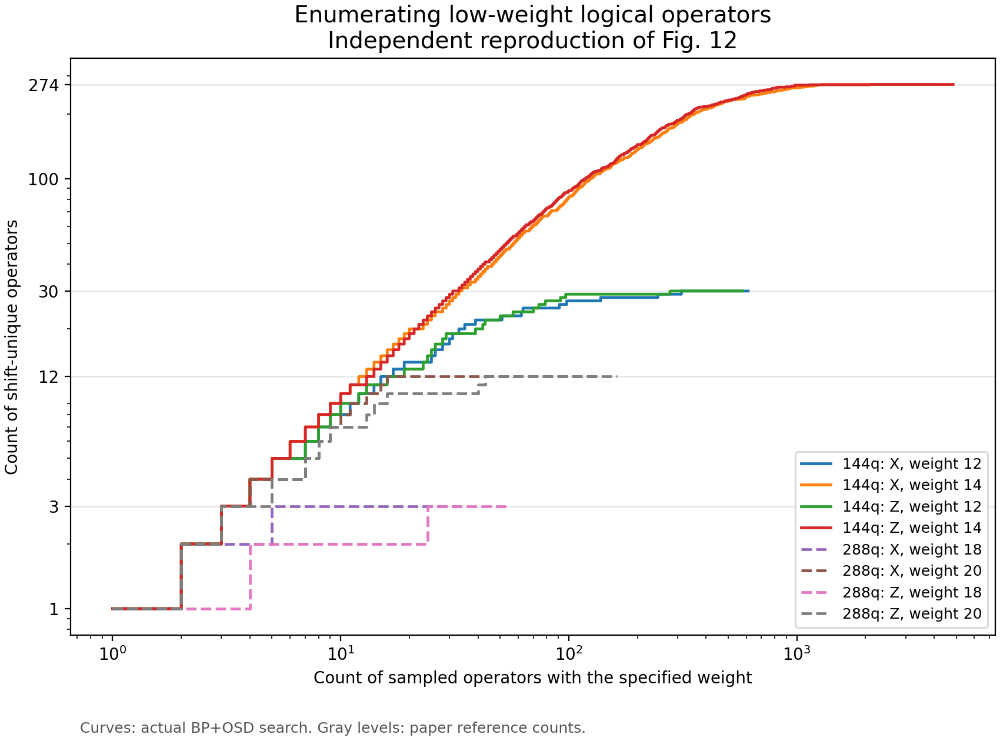

# Fig. 12 复现

本项目复现论文 [Tour de gross: A modular quantum computer based on bivariate bicycle codes](https://arxiv.org/abs/2506.03094) 的 Fig. 12。

## 文件结构

| 路径 | 内容 |
| --- | --- |
| `bicycle/` | 双变量 bicycle 码构造、GF(2) 线性代数、平移轨道和 BP+OSD 搜索 |
| `run_search.py` | 运行单个码、单个 Pauli 类型的搜索 |
| `run_all.py` | 运行四组搜索、核验结果并生成图片 |
| `plot_results.py` | 根据搜索结果绘制 Fig. 12 |
| `verify_results.py` | 验证逻辑算符、平移轨道和计数 |
| `paper_targets.json` | 论文 Fig. 12 的对照计数 |
| `requirements.txt` | Python 依赖及固定版本 |
| `setup.cmd` | Windows 环境安装入口 |
| `run_all.cmd` | Windows 完整复现入口 |
| `results/main/figure/fig12_reproduced.png` | 本次生成的复现结果图 |

## 复现结果

| 码 | 参数 | 重量 | 平移等价类 | 全部平移算符 | 与论文比较 |
| --- | ---: | ---: | ---: | ---: | ---: |
| gross | `[[144,12,12]]` | 12 | 30 | 1,884 | 一致 |
| gross | `[[144,12,12]]` | 14 | 274 | 19,728 | 一致 |
| two-gross | `[[288,12,18]]` | 18 | 3 | 336 | 一致 |
| two-gross | `[[288,12,18]]` | 20 | 12 | 1,728 | 一致 |

X、Z 两类搜索经论文给出的对偶变换得到相同的最终集合。最终计数与 Fig. 12 一致；随机搜索曲线的具体轨迹取决于程序中记录的随机种子和实现选择。

